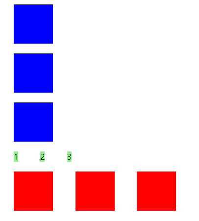

# Display : block vs inline vs inline-block

| Display      | 특정                                                                                                                               |
| ------------ | ---------------------------------------------------------------------------------------------------------------------------------- |
| block        | 1. 한 줄에 하나만 배치가능<br /> 2. width와 height 조절 가능                                                                       |
| inline       | 1. 공간이 허용된다면 한 줄에 여러 개 배치가능<br /> 2. 너비와 높이가 안에 들어있는 Content 양 만큼 자동적으로 조절됨 (조절 불가능) |
| inline-block | 1. 공간이 허용된다면 한 줄에 여러 개 배치가능 ( = inline)<br />2. width와 height 조절 가능 ( = block)                              |

<br />

```html
<!DOCTYPE html>
<html lang="en">
  <head>
    <meta charset="UTF-8" />
    <meta http-equiv="X-UA-Compatible" content="IE=edge" />
    <meta name="viewport" content="width=device-width, initial-scale=1.0" />
    <title>Document</title>
    <style>
      div,
      span {
        width: 80px;
        height: 80px;
        margin: 20px;
      }

      div {
        background-color: blue;
      }

      span {
        background-color: lightgreen;
      }

      .inline__block {
        display: inline-block;
        background-color: red;
      }
    </style>
  </head>
  <body>
    <!-- block -->
    <div></div>
    <div></div>
    <div></div>
    <!-- inline  -->
    <span>1</span>
    <span>2</span>
    <span>3</span>

    <br />

    <!-- inline-block -->
    <div class="inline__block"></div>
    <div class="inline__block"></div>
    <div class="inline__block"></div>
  </body>
</html>
```

<br />

### 결과


